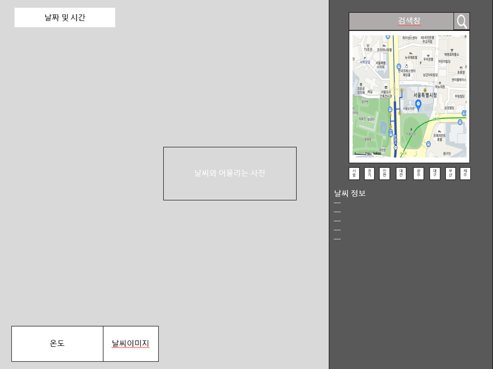
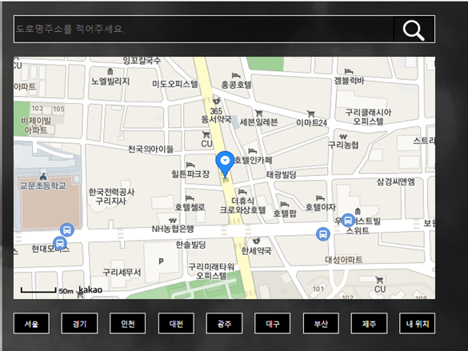
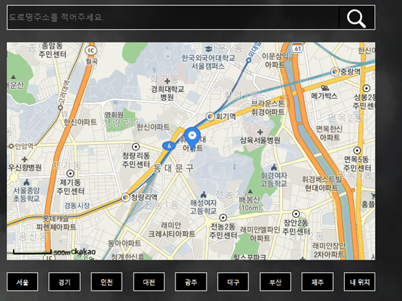
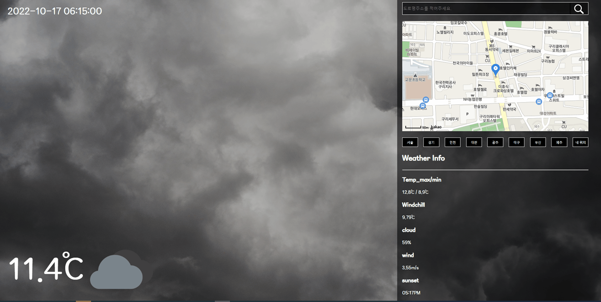

# 오늘의 날씨

## 개요 
카카오 맵을 이용하여 지도 위에 마커를 찍고, 마커의 좌표 값을 이용하여 날씨 정보를 받아오는 홈페이지

## 사용 API
- 카카오 맵 API

- OpenWeatherMap API

## 와이어 프레임

## 기능

### 홈페이지 로드 시 첫 지도 화면
 
 
 - Geolocation을 통해 홈페이지 로드 시 처음 맵 마커는 현재 위치에 생성

### 지도 이동

- 지도 클릭 시, 클릭한 위치에 마커를 생성하고 지도의 중심정을 마커의 위치로 변경 (기존 마커 제거)
- 카카오 맵 API 내부 함수 panTo를 응용하여 구현

### 완성 화면
